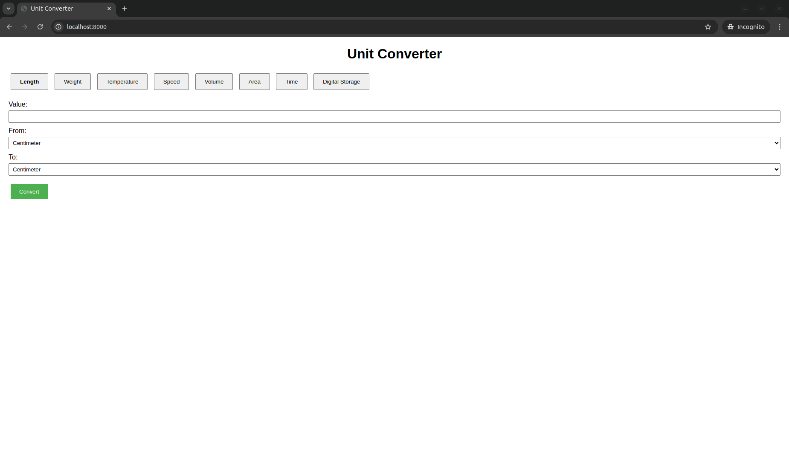
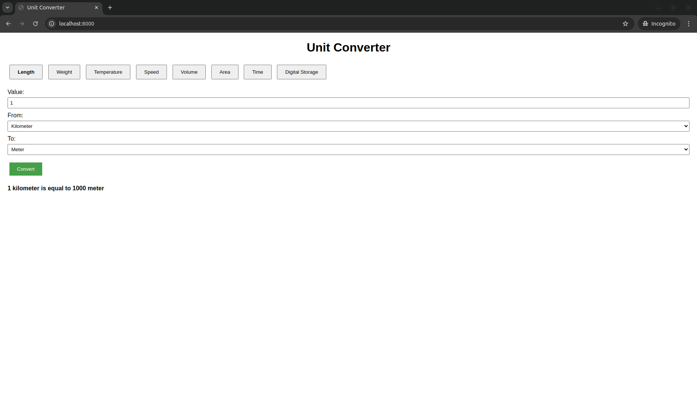

# UnitConverter
A simple website for converting units of measurement

This is a solution for project [Unit Converter](https://roadmap.sh/projects/unit-converter)

## How to run
### Prerequisites
- Python 3.10.x

### Steps
#### 1. Clone the repository
```bash
git clone https://github.com/flashhhhh/UnitConverter.git
cd UnitConverter
```

#### 2. Install dependencies
```bash
pip install -r requirements.txt
```

#### 3. Run the server
```bash
uvicorn app:app --reload
```

#### 4. Open the website
Open your browser and go to `http://localhost:8000`



**Example: Convert 1 kilometer to meter**
